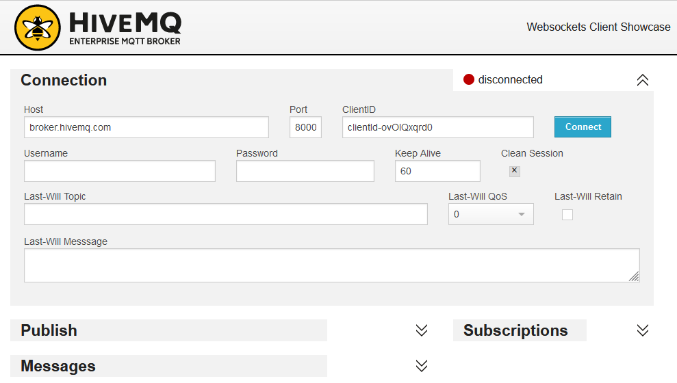
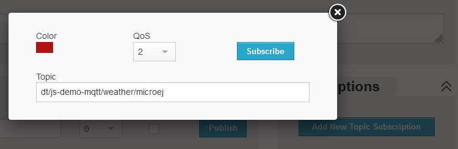
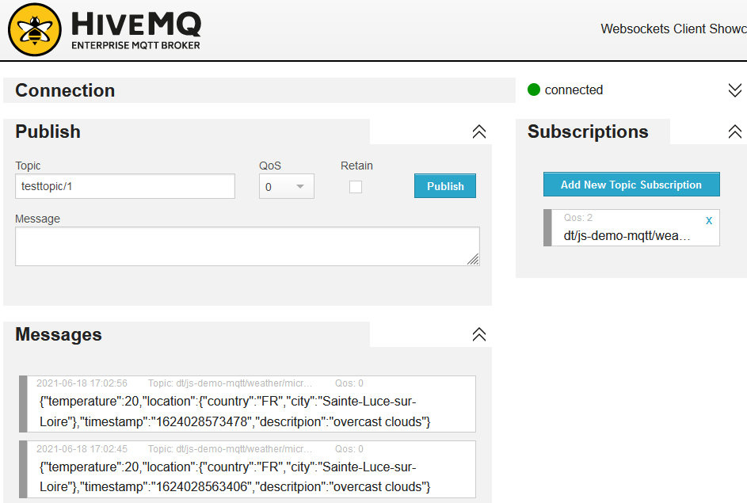
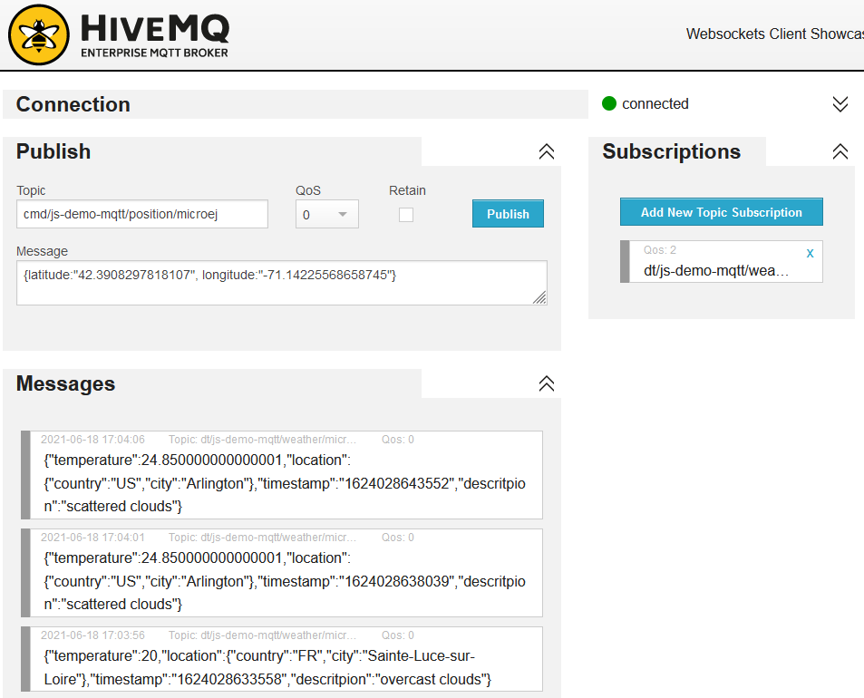

# Overview

This application publishes current weather data to a public online MQTT broker based on geographic coordinates.

The application logic is written in JavaScript and relies on the JavaScript version of [Paho](https://github.com/eclipse/paho.mqtt.javascript) MQTT client.
Paho is retrieved from [npm](https://www.npmjs.com/).

It uses the MicroEJ `LocationProvider` Service API to get positioning information from hardware.
By default, the loaded location service implementation uses the IP address of the device.

The position of the device is retrieved at application startup. It then requests a REST online service to get weather data for this position.
The weather data is sent to the MQTT broker. Weather data are refreshed and published every 10 seconds.

The current position can be updated by publishing in a  dedicated MQTT topic. When the device receives a message, the LEDS blinks for 7 seconds.

# Project Structure

- `src/main/java` contains
  * the application entry point `DemoMqtt.java` which is a Background Service (an application without UI, running in background on the firmware)
  * [WebSocket API](https://developer.mozilla.org/en-US/docs/Web/API/WebSocket) implementation in `WebSocketHostObject.java`, used by Paho
  * Java/JavaScript bridge that exposes constructors for `Resty`and `WebSocket` to JavaScript in `JsBridge.java`
- `src/main/js` contains
  * the JavaScript application main file `99-demo-mqtt.js` contains all the application logic: calling webservices for position and weather data, subscribing and publishing to MQTT broker and controlling the LEDs 
  * JavaScript dependencies retrieved by npm during the project build: `10-paho-mqtt.js`
- `src-adpgenerated/js/java` contains the code generated by the JavaScript to Java transpiler. This directory is only present when building project with SDK.
- the `package.json` npm build file. It contains the JavaScript dependencies and scripts to move and patch these dependencies to `src/main/js`.
- the `module.ivy` MMM build file. It contains the Java dependencies and MicroEJ application build configuration.

# Prerequisites

- [npm](https://www.npmjs.com/) (>= `7.15.0`) up and running on your system in order to retrieve JavaScript dependencies
- an Espressif ESP32-WROVER-KIT V4.1 board if you want to run the example on real device (not mandatory, it can also run on simulator)
- follow the [Getting Started guide](https://developer.microej.com/create-your-first-application/get-started-app-development-on-espressif-esp32-wroverkit-v41/)
instructions to get MicroEJ SDK and set up your real or virtual device
- configure MMM commande line interface from [Module Build Kit](https://docs.microej.com/en/latest/ApplicationDeveloperGuide/mmm.html?highlight=mmm%20cli#build-kit)

# Usage

## Connect to HiveMQ Public Client

HiveMQ provides a [public MQTT broker](https://www.hivemq.com/public-mqtt-broker/) and web client which do not require registration.
- open [http://www.hivemq.com/demos/websocket-client/](http://www.hivemq.com/demos/websocket-client/) in a web browser
- use `broker.hivemq.com` as Host in configuration window (see image below)



- click on the `Connect` button
- subscribe to the demo topic by clicking on the `Add New Topic Subscription` button
- enter `dt/js-demo-mqtt/weather/microej` in the `Topic` field and click on `Subscribe` button



The MQTT web client is now ready to read the data sent by the demo.


## Running from MMM Command Line Interface

- Refer to the [public documentation](https://docs.microej.com/en/latest/ApplicationDeveloperGuide/mmm.html#command-line-interface) to install and configure the MMM CLI.
- Copy all the content of the folder `module-repository` of the demo bundle to the folder `microej-module-repository` of the build kit previously installed.
- Open a terminal at the root of `js-demo-mqtt` project.
- Build the project with `mmm build"`.
- Run the example with `mmm run"`.

When the demo is run on the simulator, it should print the following traces once connected to the MQTT broker:

```
Starting MicroEJ JavaScript MQTT demo
[mqtt demo] INFO: Subscribe to channel cmd/js-demo-mqtt/position/microej
[mqtt demo] INFO: Sending weather data: {"temperature":20,"location":{"country":"FR","city":"Sainte-Luce-sur-Loire"},"timestamp":"1624028556257","descritpion":"overcast clouds"}
[mqtt demo] INFO: Sending weather data: {"temperature":20,"location":{"country":"FR","city":"Sainte-Luce-sur-Loire"},"timestamp":"1624028563406","descritpion":"overcast clouds"}
```

Your location has been retrieved from your IP address. This locations is used to get the current weather by a REST request.
The current weather data is then published to the `dt/js-demo-mqtt/weather/microej` topic:



Weather data can be updated by publishing a new position to the `cmd/js-demo-mqtt/position/microej` topic.
A position is simply a JSON object having a `latitude` and a `longitude` field. For instance

```
{latitude:"42.3908297818107", longitude:"-71.14225568658745"}
```

the current position is updated:



The new requested position should appear in the demo application logs. If the board has LEDs managed by the firmware, one should blink during
5 seconds when the message is received.

```
[mqtt demo] INFO: Sending weather data: {"temperature":20,"location":{"country":"FR","city":"Sainte-Luce-sur-Loire"},"timestamp":"1624028633558","descritpion":"overcast clouds"}
[mqtt demo] INFO: Message received: {latitude:"42.3908297818107", longitude:"-71.14225568658745"}
[mqtt demo] INFO: Sending weather data: {"temperature":24.850000000000001,"location":{"country":"US","city":"Arlington"},"timestamp":"1624028638039","descritpion":"scattered clouds"}
[mqtt demo] INFO: Sending weather data: {"temperature":24.850000000000001,"location":{"country":"US","city":"Arlington"},"timestamp":"1624028643552","descritpion":"scattered clouds"}
```

New weather data for this position are then sent to the broker as you can see in the picture above (Boston in our example).


# Requirements

- MicroEJ SDK >= `5.4.0`
- MicroUI `2.3.0`
- npm >= `7.15.0`

# Dependencies

- All Java dependencies are retrieved transitively by MicroEJ Module Manager.
- JavaScript dependencies are retrieved from NPM which is called during the build of the application.

# Source

N/A.

# Restrictions

None.


---
_Markdown_  
_Copyright 2021 MicroEJ Corp. All rights reserved._  
_Use of this source code is governed by a BSD-style license that can be found with this software._  
